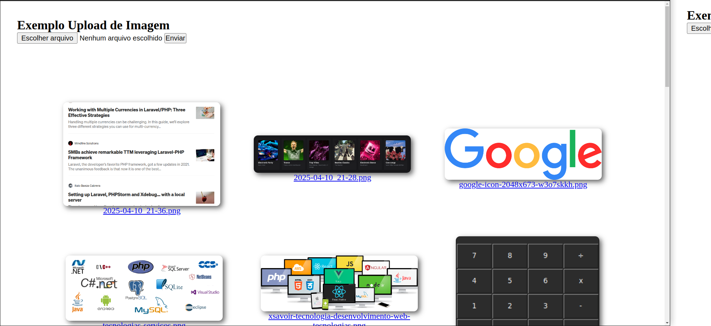

1. Fazer a validação por tamanho da imagem, não permitindo imagem maior que 16MB.

2. Fazer a criação automática do diretório upload caso não exista.

3. Construa um sistema para armazenamento de imagens, onde o usuário possa escolher arquivos de imagens para salvar e posteriormente consiga visualizar as imagens em formato de grid. Além disso o sistema deve:

    3.1. garantir apenas imagens possam ser salvas

    3.2. armazenar as imagens de forma segura não sobrepondo imagens enviadas anteriormente

    3.3. armazenar também o nome original e data de envio

    3.4. permitir fazer download da imagem ao selecionar na grid

